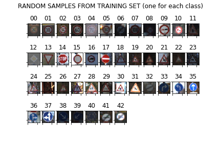
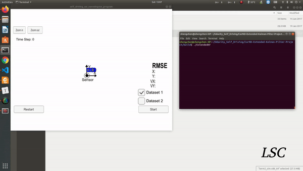

# Self-driving

## This repo is a collection of projects related to self-driving-car

### 1. [Lane Detection](https://github.com/shengchen-liu/CarND-LaneLines-P1)

Detect lane lines in images using Python and OpenCV.

### 2. [Advanced Lane Detection](https://github.com/shengchen-liu/CarND-Advanced_Lane_Finding)

Implement a lane detection pipeline with OpenCV.

### 3. [Traffic Sign Classier](https://github.com/shengchen-liu/CarND-Traffic-Sign-Classifier-Project)

Build a Traffic Sign Recognition Model with Tensorflow.

### 4. [Vehicle Detection](https://github.com/shengchen-liu/CarND_vehicle_Detection)

Develop a pipeline to reliably detect cars given a video from a roof-mounted camera.

### 5. [Behavioral Cloning](https://github.com/shengchen-liu/CarND-Behavioral-Cloning-P3-master)

Build a convolution neural network in Keras that predicts steering angles from images.  Test that the model successfully drives around track one without leaving the road.

### 6. [Extended Kalman Filter](https://github.com/shengchen-liu/CarND-Extended-Kalman-Filter-Project)

Utilize a kalman filter to estimate the state of a moving object of interest with noisy lidar and radar measurements. 

### 7. [Localization: Kidnapped Vehicle](https://github.com/shengchen-liu/CarND-Kidnapped-Vehicle-Project-master) 

Implement a 2 dimensional particle filter in C++.  The particle filter will be given a map and some initial localization information (analogous to what a GPS would provide). At each time step the filter will also get observation and control data.

### 8. [Path Planning](https://github.com/shengchen-liu/CarND-Path-Planning-Project)

Build a path planner that creates smooth, safe trajectories for the car to follow. The car transmits its location, along with its sensor fusion data, which estimates the location of all the vehicles on the same side of the road.

