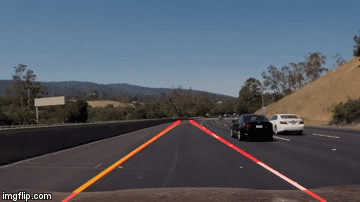
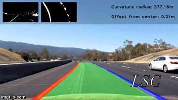
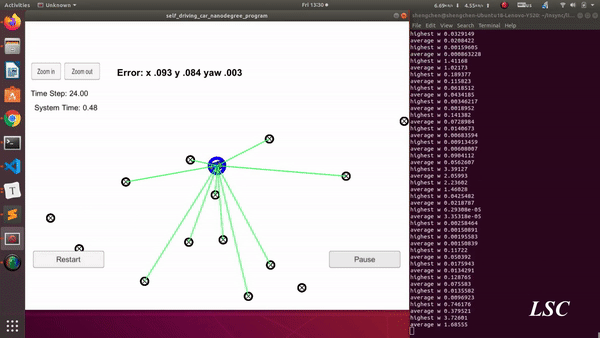

# Self-driving

## This repo is a collection of projects related to self-driving-car

### 1. [Lane Detection](https://github.com/shengchen-liu/CarND-LaneLines-P1)

Detect lane lines in images using Python and OpenCV.

### 2. [Advanced Lane Detection](https://github.com/shengchen-liu/CarND-Advanced_Lane_Finding)

Implement a lane detection pipeline with OpenCV.

### 3. Traffic Sign Classier

### 4. Vehicle Detection

### 5. Behavioral Cloning

### 6. Extended Kalman Filter

### 7. [Localization: Kidnapped Vehicle](https://github.com/shengchen-liu/CarND-Kidnapped-Vehicle-Project-master) 

Implement a 2 dimensional particle filter in C++.  The particle filter will be given a map and some initial localization information (analogous to what a GPS would provide). At each time step the filter will also get observation and control data.

### 8. [Path Planning](https://github.com/shengchen-liu/CarND-Path-Planning-Project)

Build a path planner that creates smooth, safe trajectories for the car to follow. The car transmits its location, along with its sensor fusion data, which estimates the location of all the vehicles on the same side of the road.

